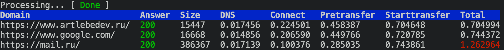

# ssts
Sites speed test script

### Requirements
curl

### Usage
```bash
echo "mysite.com" > ~/sisites4test.txt
echo "anothersite.com" > ~/sisites4test.txt
./ssts
```


### Reference
Transfer time = Total - Starttransfer
Page generation time = Pretransfer - Starttransfer
etc...
